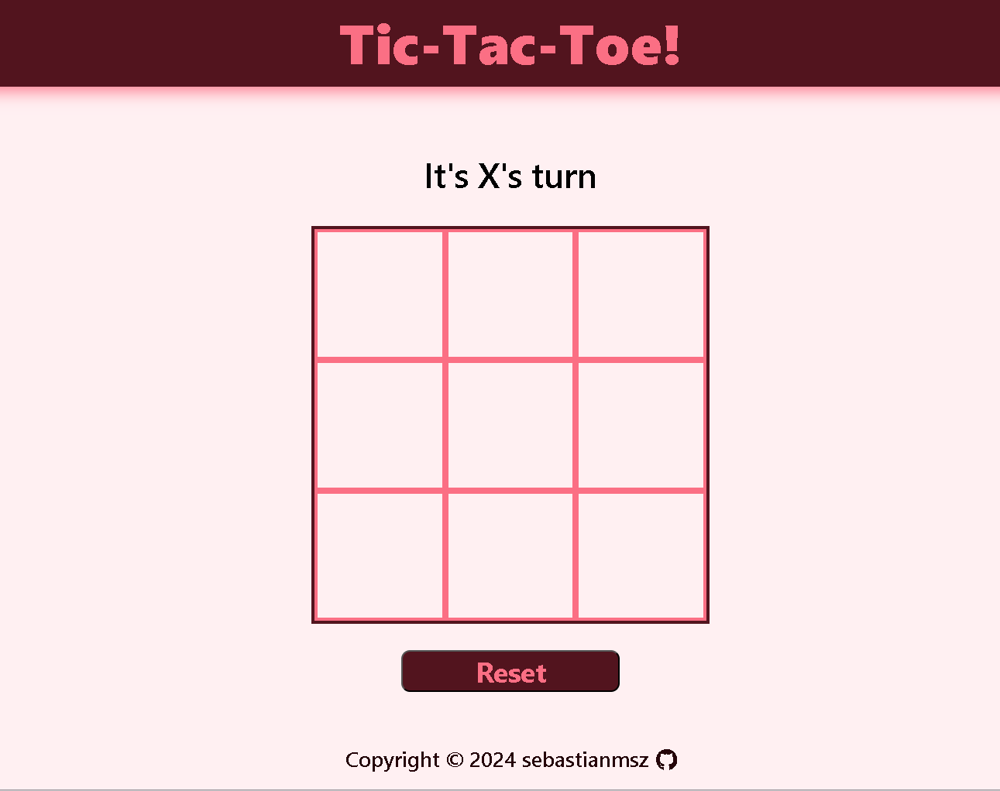

# Welcome to Tic Tac Toe: Conquer the Grid! 🆚

Experience the thrill of strategy and the satisfaction of victory with Tic-Tac-Toe Tactics, a local game designed to put your decision-making skills to the test. Whether you're a seasoned player or new to the game, our user-friendly interface and challenging game-play promise hours of fun and excitement with your friends.

Created as part of a personal project to enhance my knowledge of JavaScript modules design pattern, and function factories, Tic-Tac-Toe Tactics offers an engaging way to explore these concepts. By developing this game, I aim to strengthen my skills as a web developer while also providing a fun and accessible experience for players of all skill levels.
## Screenshot


## Getting Started

### Installation

1. Clone the repository to your local machine:

   ```bash
   git clone https://github.com/sebastianmsz/toc-tac-toe.git
   ```

2. Open the project folder in your preferred code editor.

3. Launch the `index.html` file in a web browser to view the page.

### Live Demo
Experience the project live by visiting the [Tic-Tac-Toe Game Page](https://sebastianmsz.github.io/tic-tac-toe).

## Technologies Used

- HTML5
- CSS3
- JavaScript
- Git


## Unleash Your Inner Tic Tac Toe Mastermind! 

Ready to contribute to the ultimate Tic Tac Toe experience? Share your ideas and pull requests – let's make this game legendary! 

Questions about strategic moves or want to chat web development? I'm all ears! Drop me a line at sevas.molina2004@gmail.com.

**Game on and happy coding!** ️🛸🕹️🎮
